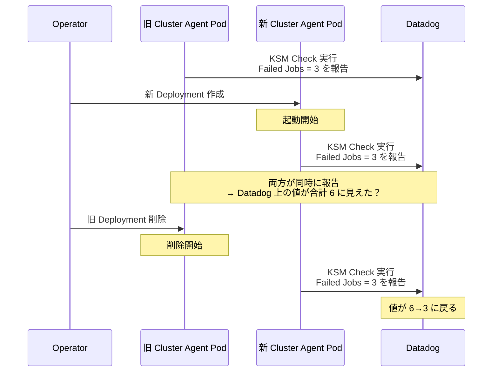

## はじめに

Datadog Operator を大幅にアップグレードした際、CronJob 失敗の監視アラートが複数同時に発火しました。念のため確認したところ全て false positive（偽陽性）で、実際の Job 失敗はゼロでした。

原因を調査した結果、Kubernetes の DaemonSet / Deployment セレクタの immutability と Datadog の KSM (Kube State Metrics) Core Check の挙動が組み合わさって発生した事象であることがわかりました。

一連の調査で得られた知見は汎用的に役立つと感じたため、記録として残すことにしました。

:::message
本記事の分析は、メトリクスデータと Kubernetes イベントに基づいていますが、一部は状況証拠からの推測を含みます。同様の事象が全ての環境で再現するとは限りません。
:::

## 何が起きたか

Datadog Operator のアップグレード完了から約 2 分後、Slack の監視チャンネルに CronJob 失敗アラートが連続で流れ始めました。

| 経過時間 | イベント |
|----------|---------|
| T+0 | ArgoCD sync 完了、新バージョンの Operator 起動 |
| T+2〜5 分 | CronJob 失敗アラートが複数発火 |
| T+10〜15 分 | 全件自動回復 |

全てのアラートが同じ変化量で発火し、回復時には変化量が 0 に戻るという同じパターンでした。

## 調査で判明した事実

### 1. KSM メトリクスの値が一時的に倍増していた

Datadog Metrics Explorer で `kubernetes_state.job.completion.failed` を確認したところ、CronJob あたりの合計値が一時的に 2 倍になり、数分後に元に戻っていました。

```
... 3, 3, 3, 3 (通常)
    6, 6, 6, 6 (約 4 分間)
    3, 3, 3, 3 ... (復旧)
```

### 2. Cluster Agent Pod が一時的に複数同時稼働していた

`kubernetes.pods.running` メトリクスを確認すると、通常 1 Pod の Cluster Agent が一時的に増加していました。


さらに、このメトリクス自体も KSM メトリクスなので、ダブルカウントの影響を受けていました（実際の Pod 数は 2、メトリクス上は 4）。

### 3. Kubernetes イベントで新旧 Pod の重複を確認

Datadog Events Explorer に記録された Kubernetes イベントから、タイムラインが確認できました。

| 経過時間 | イベント |
|----------|---------|
| T+0 | 新 Deployment 作成、新 Pod スケジュール |
| T+約 20 秒 | **新 Pod 起動完了** |
| T+約 45 秒 | **旧 Pod の Killing 開始** |

新 Pod が起動してから旧 Pod の Kill が開始されるまで、**少なくとも 25 秒間は両方が稼働**していました。

### 4. 全 CronJob の Failed Job 数がほぼ同じだった

アラートが全て change = +3 だった理由を調べると、ほぼ全ての CronJob が `kubernetes_state.job.completion.failed` の定常値 = 3 でした。

これは Kubernetes の `failedJobsHistoryLimit` の設定により、各 CronJob に過去の Failed Job オブジェクトが同数ずつ残存していたためです。

ダブルカウントにより 3→6（change = +3）となりました。

### 5. change monitor だけでなく閾値 monitor も発火していた

今回のアラートは change monitor（値の変化量を検知）から発火していました。

```
change(max(last_5m),last_5m):
  sum:kubernetes_state.job.completion.failed{...} by {kube_cronjob} >= 1
```

加えて、同じメトリクスを使う閾値（threshold）型 monitor も発火していました。ダブルカウントによる一時的な値の増加は、change monitor・閾値 monitor のどちらにも影響し得る点に注意が必要です。

### 6. メトリクス欠損（No Data）起因のアラートはゼロ

Agent DaemonSet の再作成によるメトリクス欠落で No Data アラートが出ることを想定していましたが、実際には No Data 起因のアラートは確認されませんでした。全て KSM メトリクスの値変動が原因でした。

Datadog monitor には [No Data と判定するまでの猶予期間](https://docs.datadoghq.com/monitors/configuration/#no-data) を設定できます。今回はメトリクスの欠損期間がこの猶予期間内に収まったため、No Data アラートが発火しなかったと推測しています。

## 推定される発生原因

Datadog Operator の特定バージョン（[v1.21.0](https://github.com/DataDog/datadog-operator/releases/tag/v1.21.0)）で、管理するリソースのラベル体系が `agent.datadoghq.com/*` から `app.kubernetes.io/*` に標準化されました。この破壊的変更の詳細と移行パスは[移行ガイド](https://github.com/DataDog/datadog-operator/blob/main/docs/agent_metadata_changes.md)にまとめられています。

Kubernetes では Deployment / DaemonSet の `spec.selector` は[作成後に変更できません（immutable）](https://kubernetes.io/docs/concepts/workloads/controllers/deployment/#label-selector-updates)。

通常のアップグレード（イメージ変更など）では **rolling update** により新旧 Pod の入れ替えが制御されます。しかしセレクタ変更が必要な場合、Deployment オブジェクトの再作成が必要になります。今回のケースでは Operator が旧 Deployment の **delete** と新 Deployment の **create** を行った結果、rolling update の制御が効かず、旧 Pod の terminating と新 Pod の起動が重複するタイミングが生まれました。



Kubernetes イベントから確認できた新旧 Pod の重複は約 25 秒間ですが、KSM メトリクスの倍増は約 4 分間続いていました。この差の正確な原因は特定できていません。KSM Core Check の収集間隔や、旧 Pod が terminating 状態でもしばらく報告を続けた可能性などが考えられますが、推測の域を出ません。

なお、通常の Node 入れ替え（ドレイン）では Deployment 自体は変更されず rolling update の制御下で Pod が移動するため、この事象は発生しにくいと考えています。

## 教訓

### 公式の移行パスを事前に確認する

今回のセレクタ変更については、Datadog Operator が[公式の移行ガイド](https://github.com/DataDog/datadog-operator/blob/main/docs/agent_metadata_changes.md)を用意していました。v1.18 以降で `agent.datadoghq.com/update-metadata: "true"` アノテーションを付与すれば、Operator アップグレードとは独立してセレクタ変更を事前に適用でき、[orphan deletion](https://kubernetes.io/docs/tasks/administer-cluster/use-cascading-deletion/#set-orphan-deletion-policy) によるゼロダウンタイム移行も可能でした。

特に複数のマイナーバージョンを一気に飛ばすアップグレードでは、破壊的変更が含まれる可能性が高くなります。リリースノートだけでなく、付随する移行ドキュメントまで確認することが重要です。

### それでも防げなかった場合に備える

移行ガイドに従うのが最善ですが、Pod の再作成を伴う作業では予期しないメトリクス変動が起こり得ます。影響を最小化するために、作業前に monitor を一時的に mute し、作業完了後に実際の異常がなかったかを手動で確認する運用が有効です。

```bash
# 作業時間中に実際の Job 失敗がなかったか確認
kubectl get jobs --all-namespaces \
  --field-selector status.successful=0 \
  --sort-by=.metadata.creationTimestamp | tail -20
```

mute 解除後、メトリクス系 monitor は自動的に正常状態に戻りますが、一時的な Job 失敗は後から通知されないため、手動確認が必要です。

## おわりに

今回の事象は、セレクタの immutability・KSM メトリクスのダブルカウント・monitor の検知特性といった個々には既知の挙動が組み合わさることで、予期しないアラートにつながった例でした。同様の構成で Datadog Operator のアップグレードを予定している方の参考になれば幸いです。
