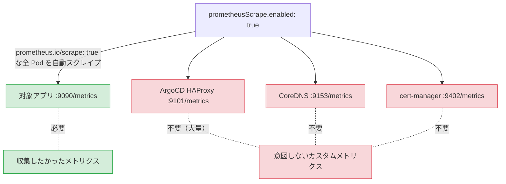

## はじめに

Datadog のカスタムメトリクス数が増加傾向にあることに気づき、棚卸しを実施した。調査の結果、`prometheusScrape` の設定によって意図しない数千のカスタムメトリクスが収集されていたことが判明した。

この記事では、カスタムメトリクスの調査手法と、`prometheusScrape` と Autodiscovery アノテーションの使い分けについてまとめる。

## 環境

- Amazon EKS
- Datadog Agent（Datadog Operator 経由で管理）
- ArgoCD（Redis HA 構成）
- CoreDNS, Sealed Secrets Controller 等の一般的な K8s コンポーネント

## カスタムメトリクスの棚卸し

### 1. 全体数の推移を確認

まず `datadog.estimated_usage.metrics.custom` で全体の推移を確認した。数ヶ月前と比較して増加傾向にあった。

```
avg:datadog.estimated_usage.metrics.custom{*}
```

### 2. メトリクス名ごとの課金数を確認

`datadog.estimated_usage.metrics.custom.by_metric` でメトリクス名ごとの内訳を確認した。

```
top(avg:datadog.estimated_usage.metrics.custom.by_metric{*} by {metric_name}, 25, "mean", "desc")
```

結果、以下の内訳だった。

| メトリクスグループ | 全体比 | 発生元 |
|------------------|--------|--------|
| haproxy_* | 約 7 割 | ArgoCD Redis HA HAProxy |
| 対象アプリ | 約 1 割 | 対象アプリ（これだけが必要） |
| coredns_* | 数% | CoreDNS |
| workqueue_* | 数% | cert-manager 等の K8s controller |
| controller_runtime_* | 数% | cert-manager 等の K8s controller |
| sealed_secrets* | 数% | Sealed Secrets Controller |

意図的に収集していたのは対象アプリのメトリクスだけで、それ以外は全て不要だった。この時点ではどの仕組みで収集されているかは不明なため、次のステップで収集元を特定する。

### 3. 収集元の特定

メトリクスの収集経路は Pod / Service のアノテーションで判別できる。今回は Claude Code で Datadog API と kubectl を組み合わせた調査を行い、収集経路の特定に至った。

- `prometheus.io/scrape: "true"` を持つ Pod / Service → prometheusScrape 経由
- `ad.datadoghq.com/*.checks` を持つ Pod → Autodiscovery 経由
- 両方持つ Pod もある（その場合 prometheusScrape を止めても Autodiscovery で継続）

```bash
# prometheusScrape の対象になる Pod を列挙
kubectl get pods --all-namespaces -o json | \
  jq -r '.items[] |
    select(.metadata.annotations["prometheus.io/scrape"] == "true") |
    [.metadata.namespace, .metadata.name, .metadata.annotations["prometheus.io/port"] // "default"] |
    @tsv'

# enableServiceEndpoints: true の場合は Service も対象
kubectl get svc --all-namespaces -o json | \
  jq -r '.items[] |
    select(.metadata.annotations["prometheus.io/scrape"] == "true") |
    [.metadata.namespace, .metadata.name, .metadata.annotations["prometheus.io/port"] // "default"] |
    @tsv'

# Autodiscovery アノテーションを持つ Pod を列挙
kubectl get pods --all-namespaces -o json | \
  jq -r '.items[] |
    select(.metadata.annotations // {} | to_entries[] | .key | startswith("ad.datadoghq.com/") and endswith(".checks")) |
    [.metadata.namespace, .metadata.name] |
    @tsv'
```

結果、収集経路は以下のように判別できた。

| メトリクスグループ | 収集経路 | アノテーション |
|------------------|---------|-------------|
| haproxy_* | prometheusScrape | `prometheus.io/scrape` (Pod) |
| coredns_* | prometheusScrape | `prometheus.io/scrape` (Service: kube-dns) |
| workqueue_* | prometheusScrape | `prometheus.io/scrape` (Pod: cert-manager 等) |
| controller_runtime_* | prometheusScrape | `prometheus.io/scrape` (Pod: cert-manager 等) |
| 対象アプリ | 両方 | `prometheus.io/scrape` + `ad.datadoghq.com/*.checks` |
| sealed_secrets* | Autodiscovery | `ad.datadoghq.com/*.checks` のみ |

不要なメトリクスの大半は prometheusScrape 経由だった。対象アプリは両方のアノテーションを持っていたため、prometheusScrape を無効化しても Autodiscovery 経由で収集が継続する。sealed_secrets は Autodiscovery のみのため影響なし。

### 4. ダッシュボード・モニターでの利用状況を確認

不要なメトリクスがダッシュボードやモニターで使われていないことを確認した。停止による影響がないことを確認してから対応に進んだ。

## 原因: prometheusScrape の挙動

以前、特定アプリケーションの OpenMetrics エンドポイントからメトリクスを収集するために、Datadog Agent に以下の設定を追加していた。

```yaml
apiVersion: datadoghq.com/v2alpha1
kind: DatadogAgent
metadata:
  name: datadog
spec:
  features:
    prometheusScrape:
      enabled: true
      enableServiceEndpoints: true
```

### prometheusScrape はグローバル設定

`prometheusScrape.enabled: true` は、クラスタ内の `prometheus.io/scrape: "true"` アノテーションを持つ全ての Pod を自動的にスクレイプする設定である（[Kubernetes Prometheus and OpenMetrics metrics collection](https://docs.datadoghq.com/containers/kubernetes/prometheus/)）。



今回の環境では、ArgoCD の HAProxy、CoreDNS（kube-dns Service）、cert-manager が `prometheus.io/scrape: "true"` を持っていた。対象アプリ以外にこれだけの Pod / Service が該当していることは、事前に把握できていなかった。

### なぜ HAProxy だけで全体の 7 割を占めるのか

Datadog のカスタムメトリクスは、メトリクス名ではなくメトリクス名 × タグ値の組み合わせごとに課金される（[Custom Metrics Billing](https://docs.datadoghq.com/account_management/billing/custom_metrics/)）。

例えば `http_requests_total` というメトリクスに `method` と `status` のタグが付く場合:

```
http_requests_total{method:GET, status:200}   → 1 カスタムメトリクス
http_requests_total{method:GET, status:404}   → 1 カスタムメトリクス
http_requests_total{method:POST, status:200}  → 1 カスタムメトリクス
```

メトリクス名は 1 つだが、課金上は 3 カスタムメトリクスになる。

HAProxy の `haproxy_server_check_status` では以下のタグが付いていた:

```
proxy:  bk_redis_master, check_if_redis_is_master_0/1/2  (4値)
server: r0, r1, r2  (3値)
state:  hana, l4con, l4ok, l4tout, l6ok, ... sockerr  (16値)
host:   複数ノード (N)
```

4 × 3 × 16 × N = 192N。この 1 メトリクス名だけで数百のカスタムメトリクスとして課金される。HAProxy はこのようなメトリクスを数百種類公開しているため、合計で数千規模に膨張していた。

### OpenMetrics 経由は全てカスタムメトリクス扱い

Datadog の公式インテグレーション（800以上）経由のメトリクスはカスタムメトリクスに該当せず、課金されない（[Custom Metrics](https://docs.datadoghq.com/metrics/custom_metrics/)）。一方、prometheusScrape は汎用の OpenMetrics check でスクレイプするため、公式インテグレーションが存在するコンポーネントであっても全てカスタムメトリクスとして課金される。

CoreDNS については以下の二重収集が発生していた:

| | ビルトインインテグレーション | OpenMetrics スクレイプ |
|---|---|---|
| メトリクス例 | `coredns.request_count` | `coredns_proxy_request_duration_seconds.bucket` |
| 課金 | なし（インテグレーションメトリクス） | カスタムメトリクスとして課金 |
| 状態 | 既に有効だった | prometheusScrape で追加された |

ビルトインインテグレーションが既に動いているのに、OpenMetrics で同じものを二重に取得している状態だった。

## 対応: Autodiscovery アノテーションへの切り替え

特定の Pod のメトリクスだけを収集したい場合は、prometheusScrape ではなく [Datadog Autodiscovery アノテーション](https://docs.datadoghq.com/containers/kubernetes/integrations/)を使う。Autodiscovery は Datadog Agent が K8s 上で動作していれば常に有効であり、追加の設定は不要である（[OpenMetrics インテグレーション](https://docs.datadoghq.com/integrations/openmetrics/)）。

```yaml
apiVersion: apps/v1
kind: Deployment
metadata:
  name: my-app
spec:
  template:
    metadata:
      annotations:
        ad.datadoghq.com/my-app.checks: |
          {
            "openmetrics": {
              "instances": [{
                "openmetrics_endpoint": "http://%%host%%:9090/metrics",
                "namespace": "my_app",
                "metrics": ["my_app_.*"]
              }]
            }
          }
    spec:
      containers:
      - name: my-app
        # ...
```

対応としては、Datadog Agent から `prometheusScrape` の設定を削除した。対象アプリの Deployment には既に `ad.datadoghq.com/*.checks` アノテーションが定義されていたため、prometheusScrape を無効化してもメトリクス収集は継続する。

反映後、Datadog Agent のログで Autodiscovery 経由の openmetrics check が動作していることを確認した。

```
$ kubectl exec <datadog-agent-pod> -c agent -- agent configcheck

=== openmetrics check ===
Configuration provider: kubernetes-container-allinone   ← Autodiscovery 経由
Config for instance ID: openmetrics:my-app:xxxxxxxx
  metrics: my_app_.*
  openmetrics_endpoint: http://x.x.x.x:9090/metrics
```

`Configuration provider` が `kubernetes-container-allinone`（Autodiscovery）であり、`prometheus_pods`（prometheusScrape）ではないことが確認できる。

### prometheusScrape vs Autodiscovery アノテーションの比較

| | prometheusScrape | Autodiscovery アノテーション |
|---|---|---|
| 設定箇所 | Datadog Agent（グローバル） | Pod のアノテーション（個別） |
| 対象 | `prometheus.io/scrape: "true"` な全 Pod | アノテーションを付けた Pod だけ |
| メトリクスフィルタ | なし（全メトリクス取得） | `metrics` で正規表現フィルタ可能 |
| 有効化条件 | `prometheusScrape.enabled: true` が必要 | 常に有効（Datadog Agent の標準機能） |
| 意図しない収集のリスク | 高い | なし |

## 参考リンク

- [Kubernetes Prometheus and OpenMetrics metrics collection](https://docs.datadoghq.com/containers/kubernetes/prometheus/)
- [Datadog Autodiscovery](https://docs.datadoghq.com/containers/kubernetes/integrations/)
- [OpenMetrics インテグレーション](https://docs.datadoghq.com/integrations/openmetrics/)
- [Custom Metrics Billing](https://docs.datadoghq.com/account_management/billing/custom_metrics/)
- [Datadog Product Allotments](https://www.datadoghq.com/pricing/allotments/)
