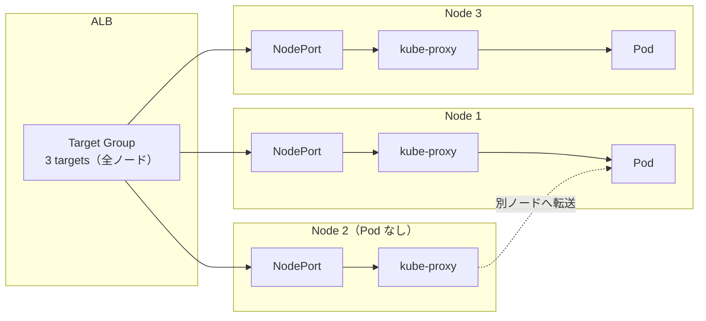
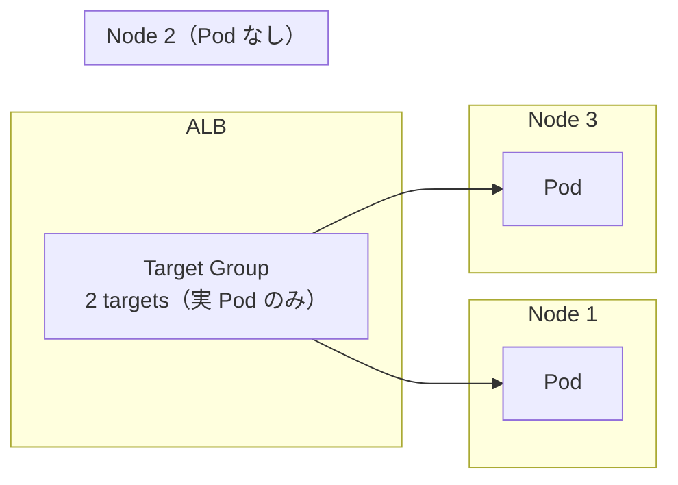

## はじめに

2020年に構築した EKS クラスタの ALB target-type を instance mode から ip mode に移行した。
この記事では、移行の判断、得られたメリット、そして ip mode にしたからこそ必要になった運用対策について書く。

## 背景: なぜ instance mode だったのか

- 2020年構築時は ALB Ingress Controller v1.x の時代。instance mode がデフォルト・標準
- ip mode は存在したが未成熟。Prefix Delegation 未提供で IP 枯渇リスクがあった
- 当時は instance mode を選ぶのが合理的な判断だった

| 時期 | 出来事 |
|------|--------|
| 2020年 | クラスタ構築。instance mode で稼働開始 |
| 2020年10月 | AWS Load Balancer Controller v2.0 リリース |
| 2021年 | VPC CNI Prefix Delegation リリース（IP 枯渇問題の解消） |
| 現在 | ip mode が AWS 推奨。前提条件（VPC CNI + [Prefix Delegation](https://zenn.dev/atrae/articles/eks-vpc-cni-prefix-delegation)）整備済み |

## 移行の判断

### instance mode の課題

#### ターゲット数の肥大化

instance mode では Pod がどのノードにいるかに関係なく、全ノードが Target Group に登録される。



ip mode では実際の Pod だけが Target Group に登録される。



ノード数やサービス数が増えるほど差は開き、AWS の TG あたりのターゲット上限（デフォルト 1,000）に達し、Ingress の分割や上限緩和の申請をするなどしていた。

#### ヘルスチェック数の肥大化

ターゲット数に比例してヘルスチェック数も増える。ip mode に切り替えてターゲット数が減った結果、ヘルスチェック数は約 9 割削減できた。

### ip mode にすべき理由

1. ターゲット数・ヘルスチェック数の削減 — 定量的に裏付けあり（上述）
2. AWS の推奨方向 — [EKS Best Practices Guide](https://docs.aws.amazon.com/eks/latest/best-practices/load-balancing.html) で ip target type が推奨されている。推奨理由として以下が挙げられている:
   - ALB → Pod 直接ルーティングで Worker Node や kube-proxy の iptables を経由しなくなり、ネットワークパスが単純化される
   - ヘルスチェックが Pod に直接届くため、ターゲットの healthy/unhealthy が Pod の実際の状態を反映する
   - パケットキャプチャ等のトラブルシューティングで ALB ↔ Pod 間の通信が直接見える
3. EKS Auto Mode のデフォルトが ip mode — [EKS Auto Mode](https://docs.aws.amazon.com/eks/latest/userguide/auto-networking.html) では ip mode がデフォルトの targeting mode になっている。将来 Auto Mode への移行を検討する場合、先に ip mode にしておくと差分が少なくなる
4. 前提条件が全て揃っている — VPC CNI, Prefix Delegation, ALB Controller 導入済み

なお、ルーティングパスの単純化によるレイテンシ改善も期待したが、正直、観測できていない。開発/本番ともに ResponseTime に有意な差は出なかった。

### instance mode を維持する理由

1. 移行リスクがゼロ — 何もしなければ壊れない
2. kube-proxy が複雑さを吸収 — ALB Controller の可用性を意識しなくてよい
3. 運用実績 — 年間単位で安定稼働

### 判断

今後のサービス成長に伴いターゲット数が増えていけば上限の問題は再発する。ip mode にすればこの問題は構造的に解消される。AWS の推奨方向とも一致しており、前提条件も揃っていたため、切り替えを決定した。

## 移行手順

### 変更箇所は 3 種類

1. Namespace に [Pod Readiness Gates](https://kubernetes-sigs.github.io/aws-load-balancer-controller/latest/deploy/pod_readiness_gate/) label を追加（なぜ必要かは[後述](#1.-pod-readiness-gates)）
2. Ingress に [`target-type: ip` annotation](https://kubernetes-sigs.github.io/aws-load-balancer-controller/latest/guide/ingress/annotations/) を追加
3. Service の type を `NodePort` → `ClusterIP` に変更（任意。ip mode では [Service type は問わない](https://kubernetes-sigs.github.io/aws-load-balancer-controller/latest/guide/ingress/annotations/)が、instance mode で必要だった NodePort を残す理由がないため変更）

なお、AWS の TG は[作成後に target type を変更できない](https://docs.aws.amazon.com/elasticloadbalancing/latest/application/load-balancer-target-groups.html#target-type)。そのため `target-type: ip` annotation を適用すると、ALB Controller は既存の TG を更新するのではなく、新しい TG を作成して切り替える。この切り替え時に瞬断が発生することがあった（発生しないケースもあった）ので、サービスごとの影響を考慮した上で適用してほしい。

## ip mode にしたからこそ必要になったこと

ip mode では ALB Controller が常時ターゲット管理を行う。instance mode では kube-proxy がルーティングを吸収していたが、ip mode ではその吸収層がなくなる。

### 1. Pod Readiness Gates

ip mode では「Kubernetes は Pod を Ready と判断したが、ALB のターゲット登録がまだ完了していない」タイミングが生まれる。この状態でローリングアップデートが進むと、旧 Pod が terminate されたのに新 Pod はまだ ALB に登録されていないという空白期間が生じる。

[EKS Best Practices Guide](https://docs.aws.amazon.com/eks/latest/best-practices/load-balancing.html) でも推奨されており、レプリカ数が少ない Deployment で zero downtime rolling deployment を実現するために必要とされている。

Readiness Gates を設定することで、ALB ターゲット登録が完了して Healthy になるまで Pod を Ready にせず、旧 Pod の terminate を防ぐ。

```yaml
apiVersion: v1
kind: Namespace
metadata:
  labels:
    elbv2.k8s.aws/pod-readiness-gate-inject: enabled
```

### 2. ALB Controller の HA 化

ip mode では Controller の停止がそのままサービス断に繋がるため、HA 構成を見直した。

- replicas の増加
- PDB の追加
- podAntiAffinity（soft / hostname）の追加

HA 構成の考慮点は [ALB Controller - Scaling your LBC](https://kubernetes-sigs.github.io/aws-load-balancer-controller/latest/deploy/scaling/) も参照。

### 3. safe-to-evict: node drain 時の 5xx を防ぐ

開発・ステージング環境での検証を経て本番に適用したが、Cluster Autoscaler の node drain で ELB_5XX が発生する事象が起きた。

原因は、drain 対象ノードに ALB Controller の leader Pod と workload Pod が同居していたことだった。drain で両方が同時に退避され、以下が重なった:

1. workload Pod の IP が到達不能になる（ALB ターゲットが消失）
2. Controller leader も同時に消えるため、死んだターゲットの deregister が遅延する
3. ALB が到達不能な Pod IP にルーティングし続け、502/503 が発生

leader lease の期限切れ待ち（約 19 秒）の後に standby Pod が leader を取得し、ターゲット更新が走って復旧した。

instance mode ではこの問題は起きない。ターゲットが Node:NodePort なので、Pod が死んでも kube-proxy が別ノードの Pod に転送する。

対策として [`safe-to-evict: "false"` annotation](https://github.com/kubernetes/autoscaler/blob/master/cluster-autoscaler/FAQ.md#what-types-of-pods-can-prevent-ca-from-removing-a-node) を追加した。これにより Cluster Autoscaler が Controller Pod のいるノードをスケールダウン対象から除外し、Controller と workload の同時退避を防ぐ。

## 移行してみての率直な感想

### 良かった点

- ターゲット数の大幅な削減（AWS 上限緩和の申請が不要に）
- ヘルスチェック起因のログ・負荷が減った（はずだが、体感できるほどではない。ただ無駄なトラフィックが減るのは気持ち良い）
- EKS Auto Mode 等への移行時に差分が少なくなる布石になった

### 想定より大変だった点

- ALB Controller の可用性が ip mode ではサービスの可用性に直結する
- 移行検証（開発 → ステージング → 本番）のコストが大きかった

## 参考

- [EKS Best Practices Guide - Load Balancing](https://docs.aws.amazon.com/eks/latest/best-practices/load-balancing.html)
- [ALB Controller - Pod Readiness Gate](https://kubernetes-sigs.github.io/aws-load-balancer-controller/latest/deploy/pod_readiness_gate/)
- [ALB Controller - Scaling your LBC](https://kubernetes-sigs.github.io/aws-load-balancer-controller/latest/deploy/scaling/)
- [ALB Controller - Ingress Annotations](https://kubernetes-sigs.github.io/aws-load-balancer-controller/latest/guide/ingress/annotations/)
- [Cluster Autoscaler FAQ - safe-to-evict](https://github.com/kubernetes/autoscaler/blob/master/cluster-autoscaler/FAQ.md#what-types-of-pods-can-prevent-ca-from-removing-a-node)
- [AWS Blog - How to rapidly scale your application with ALB on EKS](https://aws.amazon.com/blogs/containers/how-to-rapidly-scale-your-application-with-alb-on-eks-without-losing-traffic/)
- [The 502 Ghosts - Achieving Zero-Downtime Scale-Down on EKS](https://medium.com/@giorgi_kvinikadze/the-502-ghosts-achieving-zero-downtime-scale-down-on-eks-2c209f7a5b0c)
