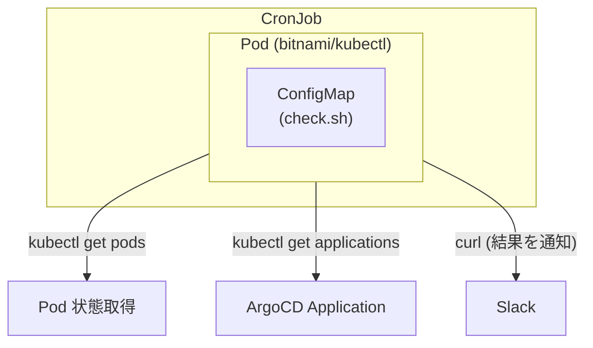

## はじめに

Kubernetes クラスタを運用していると「気づいたら Pod が CrashLoopBackOff になっていた」「ArgoCD の Sync が失敗したまま放置されていた」ということがあります。

毎朝クラスタの状態を Slack に通知する CronJob を作ったので紹介します。

## できること

- **異常 Pod の検出**: インフラ起因の問題ステータス（CrashLoopBackOff, ImagePullBackOff, OOMKilled 等）を検出
- **ArgoCD アプリの検出**: OutOfSync または Unhealthy なアプリを検出
- **ステータス別グループ化**: エラー種別ごとに日本語説明付きでまとめて表示

## アーキテクチャ



シンプルに `bitnami/kubectl` イメージで kubectl、jq、curl を使っています。

## コアロジック

check.sh の主要部分を抜粋します。

### 1. 異常 Pod の検出

```bash
# 検出対象の問題ステータス（パイプ区切り）
UNHEALTHY_STATUSES="CrashLoopBackOff|ImagePullBackOff|ErrImagePull|OOMKilled|CreateContainerConfigError|..."

# 全 namespace から問題ステータスの Pod を抽出
kubectl get pods -A --no-headers | \
  grep -E "(${UNHEALTHY_STATUSES})" | \
  awk '{printf "%s/%s\t%s\n", $1, $2, $4}' | sort
```

### 2. ArgoCD 異常アプリの検出

```bash
# OutOfSync または Unhealthy なアプリを抽出
kubectl get applications.argoproj.io -A -o json | \
  jq -r '.items[] |
    select(
      (.status.sync.status != "Synced") or
      (.status.health.status != "Healthy" and .status.health.status != "Progressing")
    ) |
    "\(.metadata.namespace)/\(.metadata.name)\t\(.status.sync.status)\t\(.status.health.status)"'
```

### 3. ステータス別グループ化

```bash
# エラーステータスの日本語説明
declare -A STATUS_DESC=(
  ["CrashLoopBackOff"]="コンテナが繰り返しクラッシュ"
  ["OOMKilled"]="メモリ不足でKill"
  # ...
)

# ステータスでソートしてグループ化
while IFS=$'\t' read -r pod status; do
  if [[ "$status" != "$current_status" ]]; then
    result="${result}*[${status}]* ${STATUS_DESC[$status]}\\n"
    current_status="$status"
  fi
  result="${result}• ${pod}\\n"
done < <(echo "$data" | sort -t$'\t' -k2)
```

## Slack 通知

### 異常がある場合

```
📋 日次ヘルスチェック (wevox-eks-cluster-dev) 📅 2026-01-20 09:00 JST
────────────────────────────────────────────
🚨 異常 Pod (3件)
*[CrashLoopBackOff]* コンテナが繰り返しクラッシュ
• backend/worker-xyz789
• batch/job-runner-def456

*[OOMKilled]* メモリ不足でKill
• monitoring/exporter-ghi012

:argo: 異常 ArgoCD Apps (1件)
*[OutOfSync/Healthy]*
• argocd/my-app
```

ステータスごとにグループ化し、日本語説明も付けているので、Kubernetes に詳しくない人でも状況を把握しやすくなっています。

### すべて正常な場合

```
📋 日次ヘルスチェック (wevox-eks-cluster-dev) 📅 2026-01-20 09:00 JST

✅ すべて正常です
```

## ポイント

### 検出対象のステータス

インフラ起因の問題にフォーカスするため、以下のステータスのみを検出対象としています。

| ステータス | 説明 |
|-----------|------|
| CrashLoopBackOff | コンテナが繰り返しクラッシュ |
| ImagePullBackOff | イメージ取得失敗（リトライ中） |
| ErrImagePull | イメージ取得失敗 |
| OOMKilled | メモリ不足でKill |
| CreateContainerConfigError | コンテナ設定エラー |
| CreateContainerError | コンテナ作成失敗 |
| InvalidImageName | 無効なイメージ名 |
| RunContainerError | コンテナ実行エラー |
| ContainerStatusUnknown | コンテナ状態不明（ノード通信途絶など） |
| Evicted | リソース不足でPodが追い出された |

`Error` ステータスは除外しています。これは汎用的すぎてアプリ起因が多いため、Datadog 等の APM で監視する方が適切と判断しました。

### 最小権限

ClusterRole は pods と applications の `get`, `list` のみ。書き込み権限は不要です。

```yaml
rules:
  - apiGroups: [""]
    resources: ["pods"]
    verbs: ["get", "list"]
  - apiGroups: ["argoproj.io"]
    resources: ["applications"]
    verbs: ["get", "list"]
```

### イメージの固定

`bitnami/kubectl` を sha256 ダイジェストで固定しています。タグだと意図しないバージョンアップが起きる可能性があるので。

```yaml
image: bitnami/kubectl@sha256:b349e60a6ae2969af84a778c0b976b050a0cc77f4fb6a4ad44307cd0a06e9d8f
```

## 導入方法

必要なリソースは以下の 5 つです。

1. **ServiceAccount** - CronJob が使用する SA
2. **ClusterRole** - pods, applications の get/list 権限
3. **ClusterRoleBinding** - SA と ClusterRole の紐付け
4. **ConfigMap** - check.sh スクリプト
5. **CronJob** - 本体

```yaml
# cronjob.yaml（抜粋）
apiVersion: batch/v1
kind: CronJob
metadata:
  name: k8s-health-report
spec:
  schedule: "0 9 * * *"  # お好きな時間に
  timeZone: "Asia/Tokyo"
  jobTemplate:
    spec:
      template:
        spec:
          serviceAccountName: health-checker
          containers:
            - name: checker
              image: bitnami/kubectl@sha256:b349e60a6ae2969af84a778c0b976b050a0cc77f4fb6a4ad44307cd0a06e9d8f
              command: ["/bin/bash", "/scripts/check.sh"]
              env:
                - name: CLUSTER_NAME
                  value: "your-cluster-name"
                - name: SLACK_WEBHOOK_URL
                  value: "https://hooks.slack.com/services/..."
              volumeMounts:
                - name: script
                  mountPath: /scripts
          volumes:
            - name: script
              configMap:
                name: health-checker-script
```

Kustomize を使う場合は overlay で `CLUSTER_NAME` と `SLACK_WEBHOOK_URL` を環境ごとにパッチします。

## 今後やりたいこと

- PVC で前回結果を保存して差分表示
  - 現在は emptyDir を使っているため、Pod 再起動時に前回結果が失われる
  - PVC を使えば永続化でき、「昨日からの差分」を正確に表示できる
- 週次サマリーの追加

## おわりに

Kubernetes は自己修復機能があり堅牢性が高いので、Pod 一つ一つを厳密に監視してアラートを飛ばすのはやりすぎだと感じていました。

かといって放置すると「いつの間にか壊れていた」になりがちです。

毎朝ゆるく状態変化をチェックする、というのがちょうど良い落とし所かなと思ってこの仕組みにしました。
