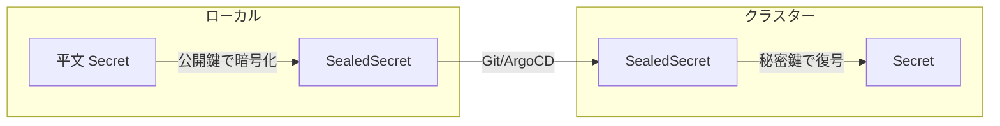
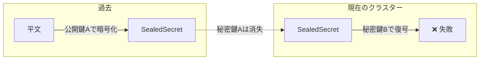
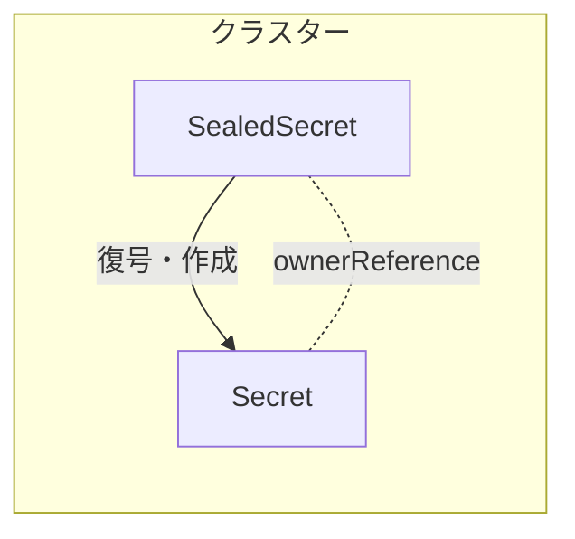
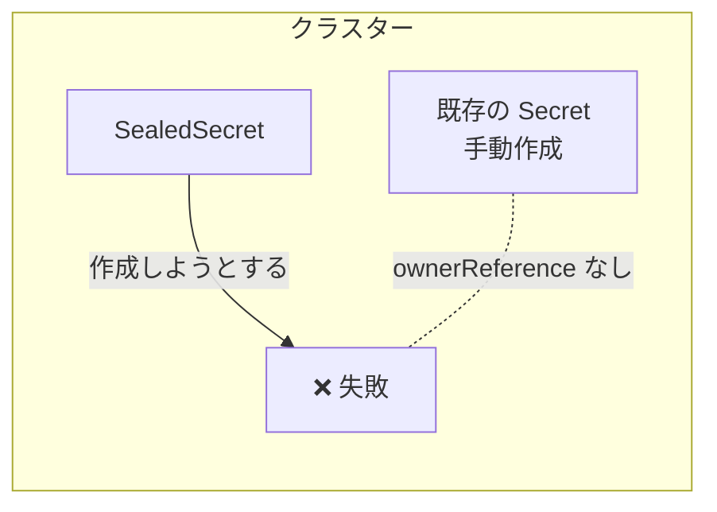

## はじめに

Sealed Secrets の調査をしていて「SealedSecret はあるのに Secret がない」という状態があることを知りました。kubectl や Controller ログから確認する方法を調べたので共有します。

:::message
本記事は Helm チャートではなく、公式の `controller.yaml` を直接使用して運用している環境を前提としています。Helm チャートには一部の設定（additionalPrinterColumns など）が含まれているため、対応が不要な場合があります。
:::

## 整合性チェック

### 数の確認

SealedSecret の数と、対応する Secret の数を比較します。

```bash
# SealedSecret の数
kubectl get sealedsecrets -A --no-headers | wc -l
```

```bash
# SealedSecret から生成された Secret の数（ownerReference で判定）
kubectl get secrets -A -o json | jq -r '
  .items[]
  | select(.metadata.ownerReferences[]?.kind=="SealedSecret")
  | "\(.metadata.namespace)/\(.metadata.name)"
' | wc -l
```

数が一致していれば OK。差がある場合は次のコマンドで詳細を確認します。

### 欠損 Secret の特定

Secret が存在しない SealedSecret を洗い出します。

```bash
kubectl get sealedsecrets -A -o json \
  | jq -r '.items[] | "\(.metadata.namespace) \(.metadata.name)"' > /tmp/ss_list.txt

while read ns name; do
  kubectl get secret "$name" -n "$ns" &>/dev/null || echo "Missing: $ns/$name"
done < /tmp/ss_list.txt
```

出力例:

```
Missing: backend-dev/old-api-secret
Missing: default/unused-token
```

### 原因の確認

欠損がある場合、Controller ログでエラーを確認します。

```bash
kubectl logs -n kube-system deployment/sealed-secrets-controller --tail=100 \
  | grep -iE "(error|fail)"
```

よくある原因:

| エラー | 原因 |
|-------|------|
| `no key could decrypt secret` | 暗号化に使ったキーが存在しない |
| `already exists and is not managed by SealedSecret` | 同名の Secret が手動作成されている |

## `no key could decrypt secret` の詳細

このエラーで何が起きてるのか整理しました。

### SealedSecrets の仕組み



- **公開鍵**: SealedSecret を作成する時に使用（`kubeseal --fetch-cert` で取得）
- **秘密鍵**: Controller がクラスター内に保持し、復号に使用
- 公開鍵と秘密鍵はペア。対応する秘密鍵がないと復号できない

### エラーが発生するケース

秘密鍵がローテーションまたは消失すると、古い公開鍵で暗号化された SealedSecret は復号できなくなります。



**結果**: `no key could decrypt secret` エラーが発生し、Secret は生成されない

### 孤立した SealedSecret の特定

復号できない SealedSecret が実際に使われているか確認するには:

```bash
# 1. Secret が存在するか確認
kubectl get secret <secret-name> -n <namespace>

# 2. 参照しているワークロードがあるか確認
kubectl get deploy,statefulset,cronjob -n <namespace> -o yaml | grep <secret-name>
```

どこからも参照されていなければ、削除しても問題ありません。

## `already exists and is not managed by SealedSecret` の詳細

このエラーは、SealedSecret が Secret を作成しようとした際に、同名の Secret が既に存在し、かつ SealedSecret の管理下にない場合に発生します。

### 正常な状態



SealedSecret が作成した Secret には `ownerReference` が設定され、SealedSecret の管理下に入ります。

### エラーが発生するケース



**結果**: `failed update: Resource "xxx" already exists and is not managed by SealedSecret` エラーが発生

## kubectl で Status を表示する

Sealed Secrets の公式 `controller.yaml` には `additionalPrinterColumns` が含まれていないため、`kubectl get sealedsecrets` で Status 列が表示されません。

v0.22.0 以降の Helm チャートには `additionalPrinterColumns` が追加されています（[PR #1217](https://github.com/bitnami-labs/sealed-secrets/pull/1217)）。

`controller.yaml` に直接変更を加えることもできますが、変更箇所を明確にするために kustomize パッチで適用します。

**crd-printer-columns-patch.yaml:**

```yaml
- op: add
  path: /spec/versions/0/additionalPrinterColumns
  value:
  - jsonPath: .status.conditions[0].message
    name: Status
    type: string
  - jsonPath: .status.conditions[0].status
    name: Synced
    type: string
  - jsonPath: .metadata.creationTimestamp
    name: Age
    type: date
```

**kustomization.yaml:**

```yaml
patches:
- path: crd-printer-columns-patch.yaml
  target:
    group: apiextensions.k8s.io
    version: v1
    kind: CustomResourceDefinition
    name: sealedsecrets.bitnami.com
```

適用後は `kubectl get sealedsecrets -A` で Status と Synced 列が表示されます:

```
NAMESPACE   NAME           STATUS                          SYNCED   AGE
backend     api-secret                                     True     30d
backend     old-secret     no key could decrypt secret     False    90d
```

## Datadog でメトリクスを収集する

Sealed Secrets Controller は `/metrics` エンドポイントで Prometheus 形式のメトリクスを公開しています。Datadog Agent で収集するには、Deployment にアノテーションを追加します。

**deployment-datadog-patch.yaml:**

```yaml
apiVersion: apps/v1
kind: Deployment
metadata:
  name: sealed-secrets-controller
  namespace: kube-system
spec:
  template:
    metadata:
      annotations:
        ad.datadoghq.com/sealed-secrets-controller.checks: |
          {
            "openmetrics": {
              "instances": [{
                "openmetrics_endpoint": "http://%%host%%:8081/metrics",
                "namespace": "sealed_secrets",
                "metrics": [
                  "sealed_secrets_controller_condition_info",
                  "sealed_secrets_controller_build_info"
                ]
              }]
            }
          }
```

**kustomization.yaml:**

```yaml
patches:
- path: deployment-datadog-patch.yaml
# Strategic Merge Patch なので target 指定は不要
```

`sealed_secrets_controller_condition_info` メトリクスで各 SealedSecret の状態を監視できます。`condition="False"` でフィルタすると異常な SealedSecret を検知できます。
